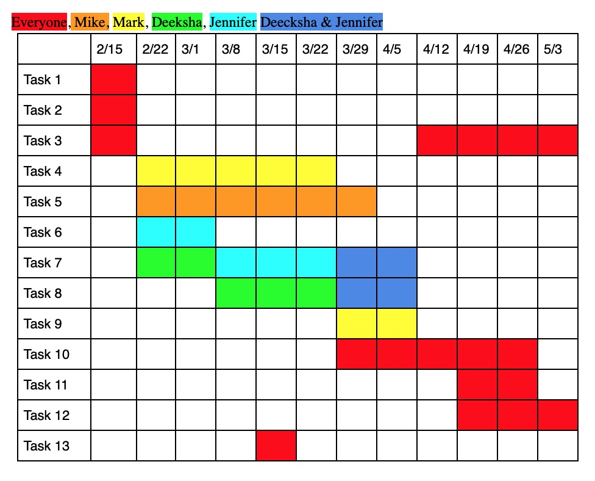

# QuickStats

QuickStats is a web-based NCAA baseball tool used to provide information about team and player tendencies through previous game play-by-plays. The website will allow for the generation of printable spray charts and other useful statistics to aid in scouting and information gathering by coaches, players, or fans.

### Tasks: ###
1. Create database & test data
2. Determine basic UI layout
3. Create & Prepare for Presentation/Poster
4. Scrape Website Info
5. Language processing of phrases
6. Create python interface for database (saving to and pulling from database)
7. Image Processing / output creation
8. Website query UI
9. Backend Controller
10. Unit testing & Bug fixes
11. User Testing & modification based on feedback
12. Final Report & Final Demo
13. Spring Break - Catch up where needed

